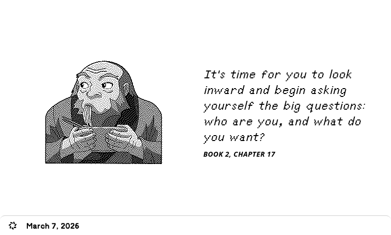
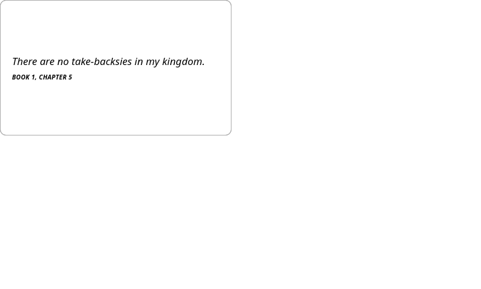

# Avatar: The Last Airbender Quotes API

A REST API serving quotes from Avatar: The Last Airbender, built with [Hono](https://hono.dev/) and deployed on Cloudflare Workers. Originally developed for plugin development on [trmnl](https://usetrmnl.com/).

---

## Endpoints

All endpoints require Basic Auth (see setup below).

| Method | Endpoint | Description |
|--------|----------|-------------|
| GET | `/` | HTML page showing quote counts per character |
| GET | `/quotes` | Returns all quotes |
| GET | `/quotes/:id` | Returns a single quote by ID |
| GET | `/random-quote` | Returns a random quote from any character |
| GET | `/random-character-quote?character=` | Returns a random quote for a given character |
| GET | `/quotes-by-character?character=` | Returns all quotes for a given character |

### Supported Characters (so far)

- `aang` 
- `bumi` 
- `iroh` 
- `katara` 
- `sokka` 
- `toph` 
- `zuko`


### Example Requests

```
# Get all quotes
GET https://your-worker.your-subdomain.workers.dev/quotes

# Get quote by ID
GET https://your-worker.your-subdomain.workers.dev/quotes/1

# Get a random quote
GET https://your-worker.your-subdomain.workers.dev/random-quote

# Get a random Iroh quote
GET https://your-worker.your-subdomain.workers.dev/random-character-quote?character=iroh

# Get all Zuko quotes
GET https://your-worker.your-subdomain.workers.dev/quotes-by-character?character=zuko
```

---

## Deploying Your Own Instance

### 1. Fork this repo

Click **Fork** at the top right of this page to copy the repo to your GitHub account.

### 2. Get your Cloudflare API Token

1. Log in to [Cloudflare](https://dash.cloudflare.com)
2. Go to **My Profile → API Tokens → Create Token**
3. Use the **Edit Cloudflare Workers** template
4. Copy the generated token — you'll need it in the next step

### 3. Set GitHub Secrets

In your forked repo, go to **Settings → Secrets and variables → Actions** and add the following secrets:

| Secret Name | Value |
|---|---|
| `CLOUDFLARE_API_TOKEN` | The API token you generated above |
| `USERNAME` | A username of your choice for Basic Auth |
| `PASSWORD` | A password of your choice for Basic Auth |

### 4. Deploy

Push a tag in the format `vX.X.X` to trigger the deploy workflow:

```bash
git tag v1.0.0
git push origin v1.0.0
```

The GitHub Action will build and deploy the Worker to Cloudflare automatically.

---

## Using with trmnl

trmnl requires a Basic Auth header when polling your API. To generate it:

1. Take your `USERNAME` and `PASSWORD` and combine them as `USERNAME:PASSWORD`
2. Base64 encode that string. You can do this in your terminal:

```bash
echo -n "YOUR_USERNAME:YOUR_PASSWORD" | base64
```

3. Use the result in your trmnl plugin header configuration:

```
authorization: Basic <your-base64-string>
user-agent: trmnl
```

**Example:** if your username is `aang` and password is `appa`, the encoded value would be `YWFuZzphcHBh`, giving you:

```
authorization: Basic YWFuZzphcHBh
user-agent: trmnl
```

4. Liquid templates are provided under [trmnl-templates](trmnl-templates). Currently full page and quadrant templates are provided. 


| | |
|---|---|
|  |  |
|  |  |


| | |
|---|---|
|  |  |
|  |  |


## Using with Docker or podman 
A (heavy) docker image is provided if you don't want to deploy using Cloudflare Workers. You can use the following docker compose: 
```yml
services:
  atla-quotes-api:
    image: ghcr.io/zuhayrali/atla-quotes-api:latest
    ports:
      - "3000:3000"
    environment:
      - USERNAME=${USERNAME}
      - PASSWORD=${PASSWORD}
    restart: unless-stopped
```

Create a `.env` file alongside it:
```
USERNAME=youruser
PASSWORD=yourpass
```